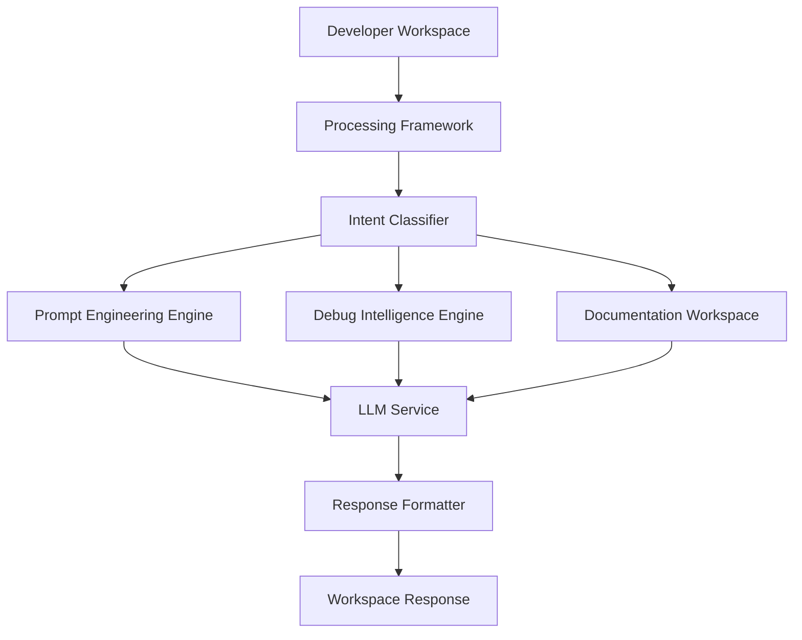
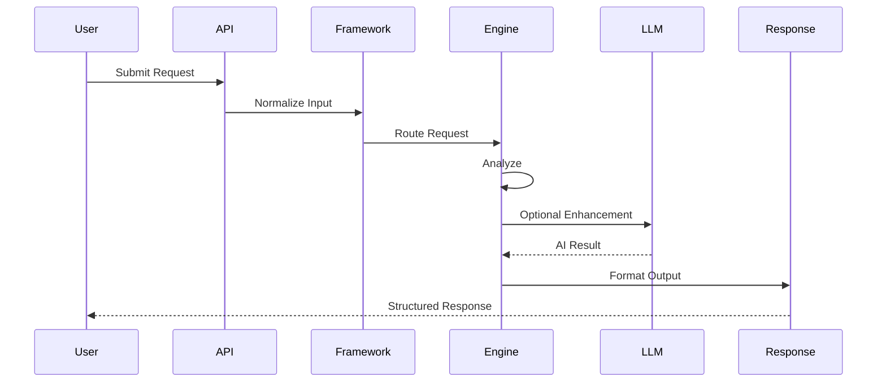
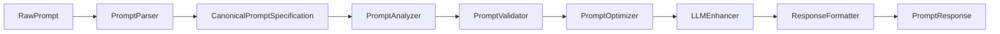
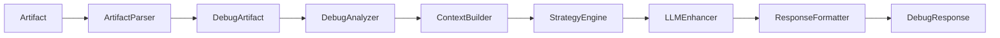

<div align="center">

# 🚀 DevPilot AI

### A Structured Intelligence Platform for Modern Software Development

**Transforming Prompt Engineering, Debugging, and Documentation into one unified developer workspace.**

<br>


<br>


<br>

**Prompt Engineering • Debug Intelligence • Documentation Workspace**

<br>

[Overview](#-overview)
•
[Architecture](#-architecture)
•
[Features](#-core-features)
•
[Getting Started](#-getting-started)
•
[Roadmap](#-roadmap)

</div>

---

# 📖 Overview

DevPilot AI is an AI-powered developer workspace designed to streamline modern software development by combining **Prompt Engineering**, **Debug Intelligence**, and **Documentation Generation** into a single platform.

Instead of functioning as another AI chatbot or code generator, DevPilot AI focuses on solving three repetitive developer workflows through structured processing pipelines.

The platform emphasizes deterministic analysis before AI reasoning, enabling more reliable, explainable, and maintainable outputs.

---

# 🎯 Vision

Modern software development requires developers to continuously switch between multiple tools.

A typical workflow often involves:

- ChatGPT
- Claude
- Gemini
- Cursor
- GitHub Copilot
- Stack Overflow
- Official Documentation
- Terminal
- GitHub Issues

Each solves one problem independently.

DevPilot AI aims to provide a unified workspace that intelligently understands developer intent and routes every request through specialized processing engines.

---

# ❓ Why DevPilot AI?

Current AI coding tools generally focus on generating code.

DevPilot AI focuses on improving the entire engineering workflow.

Rather than replacing developers, it assists with tasks that developers repeatedly perform during every project.

Examples include:

- Refining vague prompts into professional AI instructions
- Diagnosing runtime and build errors
- Generating professional project documentation
- Supporting multiple LLM providers through a common architecture
- Returning structured responses instead of raw AI output

---

# 🏗 Core Philosophy

The project is built around several engineering principles.

### Structured Intelligence

Every request follows a deterministic processing pipeline before AI reasoning is introduced.

---

### Engine-Based Architecture

Instead of one large AI assistant, DevPilot AI consists of specialized engines designed for specific workflows.

---

### AI as an Enhancement Layer

Artificial Intelligence is used to improve analysis and reasoning rather than acting as the entire application.

Rule-based systems perform deterministic tasks before AI is invoked.

---

### Provider Independence

The platform is not tied to any single AI provider.

Multiple LLM providers can be integrated through a unified abstraction layer.

---

### Structured Responses

Every engine returns structured objects instead of free-form text.

This improves maintainability, frontend rendering, testing, and future integrations.

---

# ✨ Core Features

## 🧠 Prompt Engineering Engine

Transform weak prompts into professional AI task specifications.

### Capabilities

- Prompt Analysis
- Prompt Optimization
- Prompt Scoring
- Weak Area Detection
- Clarification Flow
- Rule-Based Improvements
- Multi-Model Prompt Export
- Structured Prompt Responses

---

## 🐛 Debug Intelligence Engine

Analyze development errors using deterministic analysis before AI reasoning.

### Supported Categories

- Python Tracebacks
- JavaScript Errors
- SQL Errors
- Git Merge Conflicts
- Docker Errors
- Kubernetes Errors
- HTTP Errors
- JSON Parsing Errors
- Configuration Errors
- Runtime Exceptions
- Import Errors
- Database Errors
- Network Errors
- Generic Fallback Analysis

---

## 📚 Documentation Workspace

Generate professional software documentation using multiple input methods.

### Supported Inputs

- Project Ideas
- GitHub Repositories
- Existing README Files
- Local Project Structures

## 🤖 Multi-LLM Support

Provider-independent architecture supporting multiple AI backends.

Examples include:

- Groq
- Google Gemini
- OpenRouter
- Cerebras
- Mistral

Additional providers can be integrated without modifying the core application logic.

---

## ⚙ Structured Processing Framework

Every engine follows a standardized processing lifecycle.

```
Input

↓

Parser

↓

Canonical Model

↓

Analyzer

↓

Validator

↓

Processor

↓

AI Enhancement

↓

Formatter

↓

Structured Response
```

This architecture ensures consistency across every engine inside DevPilot AI.

---

# 📦 Key Capabilities

| Capability | Prompt | Debug | Documentation |
|------------|:------:|:------:|:-------------:|
| Rule-Based Analysis | ✅ | ✅ | ✅ |
| AI Enhancement | ✅ | ✅ | ✅ |
| Structured Responses | ✅ | ✅ | ✅ |
| Clarification Flow | ✅ | ✅ | Partial |
| Canonical Models | ✅ | ✅ | ✅ |
| Confidence Scoring | ✅ | ✅ | Planned |
| Multi-Provider Support | ✅ | ✅ | ✅ |

# 🏛 System Architecture

DevPilot AI follows a modular, engine-based architecture designed around deterministic processing pipelines. Every user request enters through a unified workspace, is analyzed by the processing framework, routed to the appropriate engine, optionally enhanced by an AI provider, and finally returned as a structured response.

Unlike traditional AI wrappers, DevPilot separates **parsing**, **analysis**, **reasoning**, and **presentation** into independent layers. This separation makes the platform easier to maintain, extend, and test.

---

## High-Level Architecture



---

## Architecture Principles

The platform is built around several architectural principles.

### Modular

Every major workflow is implemented as an independent engine.

Each engine owns:

- Models
- Processing pipeline
- API contracts
- Validation
- Formatting

without depending on implementation details of other engines.

---

### Extensible

Adding a new engine should require minimal changes to the existing system.

Example future engines:

- Code Review Engine
- Test Generation Engine
- DevOps Assistant
- Architecture Review
- Security Scanner

The Processing Framework simply routes requests to the appropriate engine.

---

### Provider Independent

The application never communicates directly with a specific LLM.

Instead it communicates through a Provider Manager.

```text
Workspace

↓

Engine

↓

LLM Service

↓

Provider Manager

↓

Gemini
OpenAI
OpenRouter
DeepSeek
Future Providers
```

Changing providers never changes engine logic.

---

### Deterministic Before AI

Every engine performs deterministic analysis before AI reasoning.

Examples:

Prompt Engine

- Prompt parsing
- Weak area detection
- Missing constraint detection

Debug Engine

- Error classification
- Artifact detection
- Language detection

Documentation

- Context extraction
- Project analysis
- Theme selection

Only after deterministic processing is AI used.

---

# ⚙ Processing Framework

The Processing Framework is the heart of DevPilot AI.

Every engine follows the same lifecycle.

```mermaid
flowchart LR

Input

-->

Parser

-->

Canonical Model

-->

Analyzer

-->

Validator

-->

Processor

-->

AI Enhancement

-->

Formatter

-->

Structured Response
```

Each stage has a single responsibility.

---

## Stage 1 — Input

The system accepts different forms of developer input.

Examples:

- Plain text
- Prompt
- Error logs
- Stack traces
- GitHub repository
- README
- Project idea
- Local project

Every input is normalized before processing.

---

## Stage 2 — Parser

The parser converts raw user input into structured internal representations.

The parser never performs AI reasoning.

Responsibilities include:

- Input normalization
- Metadata extraction
- Initial validation
- Artifact identification

---

## Stage 3 — Canonical Models

Each engine maintains its own canonical model.

| Engine | Canonical Model |
|---------|-----------------|
| Prompt Engineering | Canonical Prompt Specification |
| Debug Intelligence | Debug Artifact |
| Documentation Workspace | Canonical Project Model |

These models become the single source of truth throughout processing.

---

## Stage 4 — Analyzer

The analyzer performs deterministic inspection.

Examples include:

Prompt

- Missing context
- Missing constraints
- Weak wording
- Prompt score

Debug

- Error category
- Language
- Framework
- Severity

Documentation

- Project metadata
- Technologies
- Documentation completeness

---

## Stage 5 — Validator

The validator determines whether enough information exists.

If critical information is missing:

```text
Needs Clarification

↓

Ask One Question

↓

Continue Processing
```

The platform intentionally asks only one focused clarification question at a time.

---

## Stage 6 — Processor

The processor performs the engine-specific logic.

Prompt

- Prompt optimization

Debug

- Error diagnosis

Documentation

- Documentation generation

This stage contains the majority of business logic.

---

## Stage 7 — AI Enhancement

AI is used as an enhancement layer.

Possible responsibilities include:

- Better explanations
- Language polishing
- Alternative solutions
- Better formatting
- Additional recommendations

The application never depends solely on AI.

---

## Stage 8 — Formatter

Every engine produces structured responses.

Instead of returning paragraphs, responses follow predefined contracts.

Benefits:

- Consistent frontend rendering
- Easier testing
- API stability
- Future integrations

---

# 🧠 Request Lifecycle

Every request follows the same lifecycle.



---

# 🧭 Workspace Flow

From the user's perspective, DevPilot AI behaves as a single intelligent workspace.

```mermaid
flowchart TD

User Input

↓

Workspace

↓

Intent Classification

↓

Prompt

Debug

Documentation

↓

Processing Pipeline

↓

Structured Output
```

The user never has to think about internal routing.

---

# 🎯 Intent Classification

The Processing Framework first determines what the user wants.

Examples

| User Request | Routed To |
|--------------|-----------|
| Improve this prompt | Prompt Engineering |
| Explain this traceback | Debug Intelligence |
| Generate README | Documentation |
| Improve my documentation | Documentation |
| Optimize Cursor prompt | Prompt Engineering |
| Explain SQL error | Debug Intelligence |

Classification happens before any engine begins processing.

---

# 🧩 Engine Responsibilities

## Prompt Engineering

Primary responsibility:

Transform vague prompts into structured AI task specifications.

Outputs:

- Optimized Prompt
- Prompt Score
- Weak Areas
- Improvements
- Clarification
- Export Formats

---

## Debug Intelligence

Primary responsibility:

Diagnose development problems using deterministic reasoning before AI.

Outputs:

- Root Cause
- Severity
- Confidence
- Fixes
- Prevention
- Learning Notes

---

## Documentation Workspace

Primary responsibility:

Generate professional documentation from structured project knowledge.

Outputs:

- README
- API Docs
- Installation Guide
- Architecture Overview
- Changelog
- Contributing Guide

---

# 📦 Shared Platform Components

Every engine shares several platform services.

| Component | Responsibility |
|------------|----------------|
| Processing Framework | Standard lifecycle |
| Provider Manager | Multi-LLM routing |
| LLM Service | AI abstraction |
| Response Formatter | Structured outputs |
| Authentication | User management |
| Workspace History | Activity tracking |
| Configuration | Environment settings |

---

# 🔄 Multi-LLM Architecture

DevPilot AI is provider agnostic.

```mermaid
flowchart LR

Engine

↓

LLM Service

↓

Provider Manager

↓

Gemini

OpenAI

OpenRouter

DeepSeek

Future Providers
```

Each provider implements a common interface.

This allows providers to be swapped without affecting business logic.

---

# 📐 Design Principles

The architecture follows several engineering principles.

### Separation of Concerns

Each component has one responsibility.

---

### Composition Over Duplication

Shared functionality is centralized.

---

### Structured Data First

Every engine operates on structured models rather than raw text.

---

### Explainability

Outputs should explain **why** decisions were made rather than simply producing results.

---

### Extensibility

Future engines should integrate with the existing Processing Framework rather than introducing new architectural patterns.

---

# 📈 Scalability

The architecture is designed to support future capabilities without major refactoring.

Examples include:

- AI Code Review Engine
- Unit Test Generation
- Security Analysis
- Performance Profiling
- Architecture Validation
- Team Collaboration
- Workspace Knowledge Base
- Prompt Library
- Plugin Ecosystem

All future engines can plug into the same Processing Framework while reusing the existing infrastructure.

# 🧠 Prompt Engineering Engine

The Prompt Engineering Engine is responsible for transforming vague, incomplete, or inefficient prompts into structured AI task specifications optimized for modern Large Language Models.

Unlike traditional prompt generators, this engine focuses on **analysis before optimization**, ensuring every prompt is evaluated, improved, and explained rather than blindly rewritten.

---

## Purpose

Modern AI models are extremely capable, yet the quality of their responses depends heavily on the quality of the prompt.

Most developers write prompts that are:

- Too vague
- Missing context
- Missing constraints
- Poorly structured
- Difficult for AI to interpret

The Prompt Engineering Engine bridges that gap by converting raw instructions into professional prompt specifications.

---

# Goals

The engine is designed to:

- Improve prompt quality
- Increase response consistency
- Reduce ambiguity
- Produce reusable prompts
- Support multiple AI providers
- Explain why improvements were made

---

# Core Workflow



---

# Processing Pipeline

The engine consists of several independent stages.

---

## Stage 1 — Prompt Parser

The parser accepts raw developer instructions.

Examples:

```
Create a login API
```

```
Improve this Cursor prompt
```

```
Generate a better Claude prompt
```

```
Optimize this ChatGPT instruction
```

Instead of immediately optimizing, the parser converts the request into a structured internal representation.

---

## Canonical Prompt Specification (CPS)

Every prompt becomes a structured object before processing.

```text
Goal

Context

Constraints

Input

Expected Output

Examples

Target Model

Audience

Metadata
```

The optimizer never works directly with raw text.

---

## Stage 2 — Prompt Analyzer

The analyzer performs deterministic inspection.

It detects:

- Missing Context
- Missing Constraints
- Missing Examples
- Missing Output Format
- Weak Instructions
- Ambiguous Wording
- Missing Acceptance Criteria

No AI is required for this stage.

---

## Prompt Score

Every prompt receives a quality score.

Example:

| Category | Score |
|----------|------:|
| Clarity | 95 |
| Context | 82 |
| Constraints | 60 |
| Output Format | 88 |
| Examples | 40 |
| Overall | 81 |

---

## Weak Area Detection

Example output:

```
Weak Areas

• Missing Context

• Missing Constraints

• Missing Examples

• Output format unspecified
```

This allows developers to understand why a prompt is weak.

---

## Stage 3 — Prompt Validator

The validator determines whether optimization should continue.

If the prompt lacks critical information, processing pauses.

Example:

Input

```
Build an application.
```

Response

```
Clarification Required

What type of application?

• Web Application

• Mobile App

• REST API

• Desktop Software
```

Only one clarification question is asked at a time.

---

## Stage 4 — Prompt Optimizer

The optimizer performs deterministic improvements.

Responsibilities include:

- Better sentence structure
- Improved formatting
- Better task ordering
- Explicit constraints
- Output specification
- Context enhancement
- Requirement expansion

---

## Rule-Based Optimization

Before AI is involved, several rule-based improvements are applied.

Examples:

Original

```
Generate API
```

Improved

```
Generate a REST API using FastAPI.

Requirements:

• Async endpoints

• JWT Authentication

• SQLAlchemy

• Proper error handling

Output:

Complete production-ready implementation.
```

---

## Stage 5 — LLM Enhancement

After deterministic optimization, the prompt may optionally be enhanced using an AI provider.

Responsibilities include:

- Natural language refinement
- Better wording
- Improved readability
- Better instruction ordering
- Advanced prompt engineering

---

## Stage 6 — Response Formatter

The final stage prepares a structured response.

Example:

```json
{
  "analysis": {},
  "optimized_prompt": "...",
  "prompt_score": {},
  "why_better": [],
  "next_actions": []
}
```

---

# Engine Responsibilities

The Prompt Engineering Engine is responsible for:

- Prompt Analysis
- Prompt Optimization
- Prompt Validation
- Prompt Scoring
- Clarification Flow
- Multi-Provider Formatting
- Structured Responses

It is **not** responsible for:

- Code generation
- Chat conversations
- Executing prompts

---

# Supported Prompt Types

Examples include:

| Prompt Type | Supported |
|------------|:---------:|
| ChatGPT | ✅ |
| Claude | ✅ |
| Gemini | ✅ |
| Cursor | ✅ |
| Windsurf | ✅ |
| Copilot | ✅ |
| Generic LLM | ✅ |

---

# Optimization Features

The engine improves prompts by adding:

- Project Context
- Technical Constraints
- Output Requirements
- Success Criteria
- Formatting Rules
- Examples
- Best Practices

---

# Response Structure

Every optimization produces a structured response.

```text
Analysis

↓

Prompt Score

↓

Weak Areas

↓

Optimized Prompt

↓

Improvement Summary

↓

Why It's Better

↓

Next Actions
```

---

# Export Targets

Optimized prompts can be exported for different environments.

Examples:

- ChatGPT
- Claude
- Gemini
- Cursor
- Windsurf
- GitHub Copilot

The formatting layer adapts prompts while preserving their intent.

---

# Example Workflow

Input

```
Build a todo app
```

↓

Analysis

```
Missing Framework

Missing Database

Missing Constraints

Missing Output Format
```

↓

Optimization

```
Build a Todo application using React, FastAPI, and PostgreSQL.

Requirements:

• JWT Authentication

• CRUD Operations

• Responsive UI

• RESTful APIs

Output:

Complete project structure with explanations.
```

↓

Response

```
Prompt Score

94/100

Optimized Prompt

Improvement Summary

Next Actions
```

---

# Prompt Engineering APIs

| Endpoint | Purpose |
|-----------|----------|
| POST /api/build/process | Analyze and optimize prompt |
| POST /api/build/export | Export optimized prompt |
| GET /api/build/examples | Example prompts |
| GET /api/build/providers | Supported providers |

---

# Internal Components

```
Prompt Parser

↓

Canonical Prompt Specification

↓

Prompt Analyzer

↓

Prompt Validator

↓

Prompt Optimizer

↓

LLM Enhancer

↓

Response Formatter
```

---

# 🐛 Debug Intelligence Engine

The Debug Intelligence Engine helps developers understand, diagnose, and resolve software development issues using a combination of deterministic analysis and AI-assisted reasoning.

Rather than simply explaining an error message, the engine identifies root causes, recommends fixes, provides learning resources, and suggests preventive measures.

---

# Purpose

Developers spend a significant amount of time debugging.

Most AI tools simply explain the error.

DevPilot goes further by providing:

- Root Cause Analysis
- Error Classification
- Confidence Scores
- Suggested Fixes
- Prevention Strategies
- Learning Resources
- Next Actions

---

# Processing Workflow



---

# Supported Artifact Types

The engine currently supports deterministic detection of multiple categories.

| Artifact | Supported |
|----------|:---------:|
| Python Traceback | ✅ |
| ImportError | ✅ |
| ModuleNotFoundError | ✅ |
| NameError | ✅ |
| TypeError | ✅ |
| AttributeError | ✅ |
| IndexError | ✅ |
| KeyError | ✅ |
| FileNotFoundError | ✅ |
| PermissionError | ✅ |
| SyntaxError | ✅ |
| Git Merge Conflict | ✅ |
| SQL IntegrityError | ✅ |
| SQL Connection Error | ✅ |
| Address Already In Use | ✅ |
| Timeout Error | ✅ |
| Docker Build Error | ✅ |
| Docker Image Error | ✅ |
| JSON Decode Error | ✅ |
| Kubernetes CrashLoopBackOff | ✅ |
| Generic Runtime Errors | ✅ |

---

# Artifact Detection

Incoming input is first classified.

Examples:

```
Python Traceback

↓

Python Analyzer
```

```
Git Conflict

↓

Git Strategy
```

```
Docker Error

↓

Docker Strategy
```

Each category follows specialized diagnostic rules.

---

# Context Builder

The Context Builder enriches debugging information before AI is involved.

Possible context includes:

- Imported modules
- Framework detection
- Configuration files
- Environment variables
- Documentation references
- Dependency hints

---

# Strategy Engine

Different categories require different debugging strategies.

Examples:

Python

- Traceback analysis
- Imports
- Virtual environment

Docker

- Build stages
- Dockerfile inspection
- Missing files

Database

- Constraints
- Connections
- Transactions

Git

- Merge conflicts
- Branch state

---

# Confidence Score

Each diagnosis receives a confidence score.

Example:

| Category | Confidence |
|----------|-----------:|
| ImportError | 98% |
| NameError | 95% |
| Git Conflict | 96% |
| SQL Integrity | 90% |
| Generic Runtime | 62% |

The score reflects diagnostic confidence, not absolute correctness.

---

# Response Structure

Every debug response includes:

```
Analysis

↓

Severity

↓

Confidence

↓

Root Cause

↓

Explanation

↓

Suggested Fix

↓

Prevention

↓

Learning Resources

↓

Next Actions
```

---

# Debug APIs

| Endpoint | Purpose |
|-----------|----------|
| POST /api/debug/process | Analyze artifact |
| GET /api/debug/error-types | Supported handlers |
| GET /api/debug/strategies | Debug strategies |

---

# Internal Components

```
Artifact Parser

↓

Debug Artifact

↓

Analyzer

↓

Context Builder

↓

Strategy Engine

↓

LLM Enhancer

↓

Response Formatter
```
# 📚 Documentation Workspace

The Documentation Workspace is responsible for transforming project knowledge into professional, well-structured technical documentation.

Unlike traditional README generators that simply rewrite prompts using AI, DevPilot AI follows a structured documentation pipeline built around a **Canonical Project Model (CPM)**. Every supported input is normalized into this common representation before any document is generated.

This design allows multiple input sources, multiple document types, multiple visual themes, and multiple writing profiles while maintaining consistency across the entire documentation system.

---

# Purpose

Software documentation is often incomplete, inconsistent, outdated, or written manually.

Developers repeatedly spend time creating:

- README files
- Installation guides
- API documentation
- Architecture overviews
- Contributing guides
- Deployment instructions

The Documentation Workspace automates this process while preserving structure, readability, and customization.

---

# Goals

The Documentation Workspace aims to:

- Generate professional documentation
- Improve existing documentation
- Standardize project structure
- Support multiple document styles
- Support multiple visual themes
- Generate consistent markdown
- Separate content from presentation

---

# Core Processing Pipeline


---

# Four Input Modes

The Documentation Workspace supports four primary entry points.

## 1. Project Idea

The user describes an idea.

Example:

```
Build an AI powered expense tracker using React and FastAPI.
```

↓

Context Extractor

↓

Canonical Project Model

↓

Professional Documentation

---

## 2. GitHub Repository

The user provides a GitHub repository.

The system extracts:

- Repository metadata
- Languages
- Technologies
- Folder structure
- Existing documentation

↓

Canonical Project Model

↓

Improved Documentation

---

## 3. Existing README

Users can upload an existing README.

The system analyzes:

- Missing sections
- Formatting quality
- Readability
- Documentation completeness

↓

Improved README

---

## 4. Local Project

The Documentation Workspace analyzes a local project.

Possible sources include:

- Source code
- Package managers
- Folder structure
- Configuration files
- Existing documentation

↓

Canonical Project Model

↓

Generated Documentation

---

# Canonical Project Model (CPM)

The Canonical Project Model is the heart of the Documentation Workspace.

Regardless of input source, every project becomes one structured representation.

```
Project

↓

Metadata

↓

Technologies

↓

Features

↓

Architecture

↓

Dependencies

↓

Folder Structure

↓

API Information

↓

Deployment

↓

License

↓

Author
```

This model becomes the single source of truth for every generated document.

---

# Context Extractors

Each input mode has its own specialized extractor.

| Extractor | Purpose |
|------------|----------|
| Idea Context Extractor | Project ideas |
| GitHub Context Extractor | Repository analysis |
| README Context Extractor | Existing documentation |
| Local Project Extractor | Local source analysis |

Each extractor produces the same Canonical Project Model.

---

# Knowledge Builder

The Knowledge Builder transforms raw project data into documentation-ready content.

Responsibilities include:

- Organizing sections
- Generating descriptions
- Understanding project intent
- Identifying missing information
- Prioritizing important content
- Preparing structured documentation blocks

The Knowledge Builder is responsible for **what should be written**, not how it looks.

---

# Documentation Content Model

Documentation is stored as structured content rather than markdown.

Example sections include:

- Overview
- Features
- Installation
- Quick Start
- Project Structure
- API Reference
- Configuration
- Deployment
- Troubleshooting
- FAQ
- Future Plans
- License

Only after the content model is complete does rendering begin.

---

# Smart Section Detection

Every project does not require every documentation section.

The Documentation Workspace intelligently determines which sections should be generated.

Examples:

REST API

Generate:

- API Reference
- Authentication
- Endpoints

CLI Tool

Generate:

- Commands
- Flags
- Examples

Library

Generate:

- Installation
- Usage
- Examples

Website

Generate:

- Features
- Deployment
- Configuration

---

# Documentation Profiles

Profiles define the writing style.

They affect tone, emphasis, and content—not appearance.

Available profiles include:

| Profile | Purpose |
|----------|----------|
| Professional | Production projects |
| Open Source | Community repositories |
| Enterprise | Internal documentation |
| Portfolio | Personal projects |
| Startup | Product repositories |
| Educational | Tutorials and learning |

Profiles are independent from themes.

---

# Theme Engine

Themes define presentation rules rather than content.

Themes control:

- Typography
- Header layout
- Badge placement
- Tables
- Code block styling
- Section spacing
- Emoji usage
- Navigation layout

Changing a theme never changes the documentation content.

---

# Built-in Themes

Examples:

| Theme | Description |
|---------|-------------|
| Professional | Clean technical documentation |
| Minimal | Lightweight markdown |
| Modern | Balanced visual hierarchy |
| Open Source | GitHub-style community documentation |

Additional themes can be added without changing the generation pipeline.

---

# Asset Builder

The Asset Builder prepares supporting elements used throughout documentation.

Examples include:

- Shields.io badges
- Project statistics
- Technology badges
- Folder trees
- Mermaid diagrams
- Navigation links
- Icons
- Tables

Assets are generated independently from document content.

---

# Markdown Renderer

The Markdown Renderer combines:

```
Documentation Content

+

Theme

+

Assets

↓

Professional Markdown
```

The renderer is responsible only for presentation.

It does not generate content.

---

# Supported Documents

The Documentation Workspace is capable of generating multiple document types.

Examples include:

- README.md
- API Documentation
- Installation Guide
- Architecture Overview
- Deployment Guide
- Environment Setup
- Contributing Guide
- Changelog
- Release Notes
- User Guide
- Developer Guide

Future document types can be added using the same processing pipeline.

---

# README Generation

README generation supports two primary workflows.

## Generate From Scratch

The user provides:

- Project idea
- Technologies
- Features

↓

Complete README

---

## Improve Existing README

The user uploads an existing README.

The Documentation Workspace:

- Improves formatting
- Adds missing sections
- Enhances readability
- Preserves project intent

↓

Enhanced README

---

# Documentation Quality

The Documentation Workspace evaluates generated content using quality metrics.

Possible future metrics include:

- Completeness
- Readability
- Structure
- Navigation
- Formatting
- Documentation Coverage

These metrics help identify missing information before rendering.

---

# Response Structure

Every documentation request returns structured data.

```
Project Context

↓

Generated Content

↓

Theme

↓

Assets

↓

Rendered Markdown

↓

Metadata
```

---

# Documentation APIs

| Endpoint | Purpose |
|-----------|----------|
| POST /api/document/process | Process documentation request |
| GET /api/document/themes | Available themes |
| GET /api/document/profiles | Available profiles |
| GET /api/document/document-types | Supported document outputs |

---

# Internal Components

```
Context Extractors

↓

Canonical Project Model

↓

Knowledge Builder

↓

Documentation Content

↓

Asset Builder

↓

Theme Engine

↓

Markdown Renderer

↓

Response Formatter
```

---

# Theme vs Profile

One common misconception is confusing themes with profiles.

They solve different problems.

| Theme | Profile |
|---------|----------|
| Controls appearance | Controls writing style |
| Typography | Tone |
| Layout | Audience |
| Headers | Technical depth |
| Badges | Vocabulary |
| Tables | Explanation level |

Example:

Professional Theme

+

Open Source Profile

↓

Professional looking documentation written for community contributors.

---

# Future Enhancements

The Documentation Workspace has been designed to support future capabilities.

Potential additions include:

- Interactive Documentation
- Multi-language generation
- PDF export
- DOCX export
- Documentation versioning
- Documentation comparison
- AI-powered review
- Architecture diagram generation
- API schema synchronization
- Live documentation updates

These capabilities can be integrated without changing the underlying processing architecture.

---

# Design Principles

The Documentation Workspace follows several engineering principles.

- Separate content from presentation.
- Normalize all inputs into a Canonical Project Model.
- Generate structured content before rendering.
- Use themes for appearance, not content.
- Use profiles for writing style, not layout.
- Keep documentation modular and reusable.
- Ensure consistent outputs across all supported document types.

The result is a flexible documentation engine capable of producing professional technical documentation while remaining maintainable, extensible, and provider-independent.

